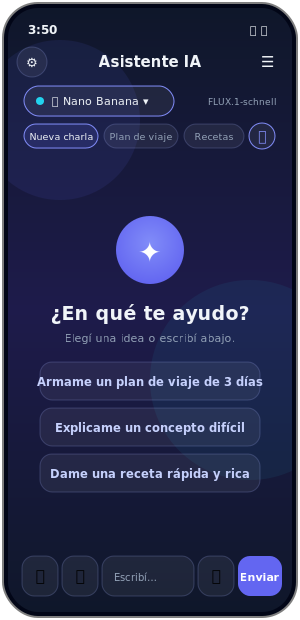
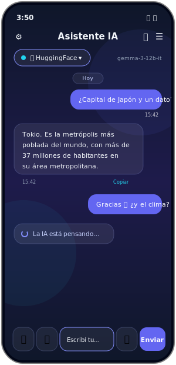
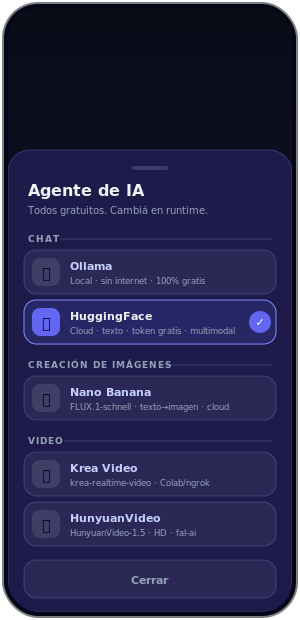
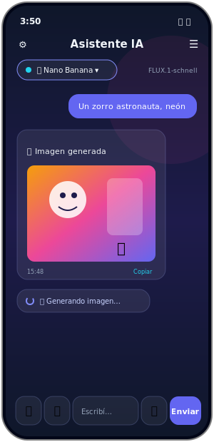
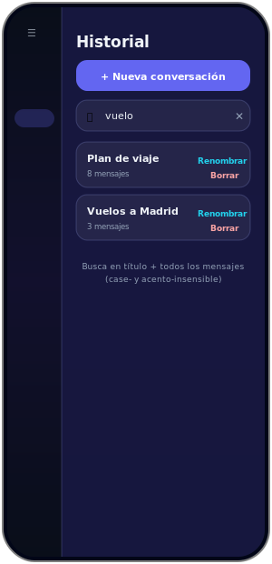
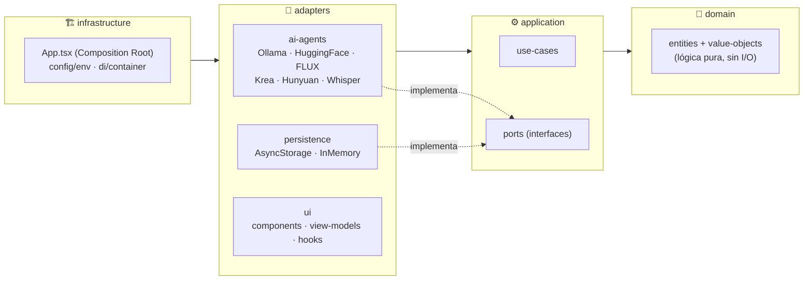

# 🤖 Mobile AI Assistance

> Asistente de IA para el celular que conversa con **agentes gratuitos** (Ollama local · HuggingFace), **genera imágenes** (FLUX) y **video** (Krea · HunyuanVideo), **ve** tus fotos, **transcribe** notas de voz y **comparte** conversaciones. Construido con **Clean Architecture** y **TDD (Spec-First)** sobre **TypeScript + React Native / Expo**.

<p align="center">
  
  
  
  
  
  
  
</p>

---

## 💡 La idea

Un asistente de IA en el celular que **no depende de APIs pagas**: conectalo a un **Ollama** corriendo en tu máquina (100% local y gratis) o a **HuggingFace** con un token gratuito, y sumá agentes de **generación de imagen y video**. El proveedor se elige **en runtime** desde la propia UI y todos los agentes se comportan igual gracias a un **contrato compartido**.

El foco técnico es la **arquitectura**: el núcleo de negocio (dominio + casos de uso) se construyó y testeó **sin framework** hasta tener cobertura verde; recién entonces se le puso React Native encima como una simple capa de render. La lógica de UI vive en *view-models* de TS puro **testeables con Vitest**, no en los componentes.

---

## 📸 Capturas

<p align="center">
  
  
  
</p>
<p align="center">
  
  
</p>

<p align="center"><sub>Mockups del diseño real (paleta, gradiente y componentes del proyecto). Reemplazá por capturas del dispositivo cuando quieras — mismo path <code>docs/screenshots/</code>.</sub></p>

---

## ✨ Características

#### 🧠 Agentes (elegís en runtime, todos gratuitos)
- 💬 **Chat** — **Ollama** (local, sin internet) y **HuggingFace** (cloud, multimodal).
- 🎨 **Generación de imágenes** — **FLUX.1-schnell** ("Nano Banana"), texto → imagen.
- 🎬 **Generación de video** — **Krea** (Colab/ngrok) y **HunyuanVideo-1.5** (fal-ai).
- 👁️ **Visión** — el agente multimodal **ve** las fotos que mandás (no solo el nombre).
- 🎤 **Transcripción de voz** — **Whisper** en HuggingFace; grabás y se manda el texto.

#### 💬 Experiencia de chat
- ⚡ **Envío optimista** — tu mensaje aparece al instante + "La IA está pensando…" (o "🎨 Generando imagen…" según el agente).
- 📎 **Adjuntos** — los de texto se inyectan al prompt; los binarios van por referencia.
- 📷 **Cámara** — sacá una foto y mandala al modelo de visión (con miniatura + lightbox).
- 🖼️ **Imágenes en la burbuja** — foto subida o imagen generada, con visor a pantalla completa.

#### 🗂️ Gestión de conversaciones
- 🔀 **Selector rápido** — tira de chips arriba del chat para saltar entre charlas + ＋ nueva.
- 🧵 **Concurrencia en vivo** — disparás una generación en una charla, te vas a otra y al volver ves su estado real (sigue trabajando en segundo plano).
- 🔎 **Búsqueda full-text** en el historial (case- y acento-insensible, busca dentro de los mensajes).
- ✏️ **Renombrar / borrar** conversaciones; 📤 **exportar/compartir** como texto plano.
- 🗂️ **Historial lateral** translúcido (drawer con efecto vidrio).

#### ⚙️ Configuración y robustez
- 🔧 **Pantalla de Ajustes** — editá el token de HuggingFace y la URL de Ollama desde la app (persisten y reinician el container).
- 🛟 **Red de seguridad anti-brick** — si una config inválida rompe el arranque, un botón borra los ajustes guardados y reintenta.
- 🎨 **Tema visual** propio — gradientes, glow, tipografía display (Space Grotesk) y animaciones one-shot.

---

## 🧱 Arquitectura

**Clean Architecture** con la **regla de dependencia hacia adentro**. El sentido de los imports lo **hace cumplir ESLint** (`no-restricted-imports`): si un import cruza una frontera prohibida, `pnpm lint` falla — no es solo convención.



| Capa | Qué vive acá | Reglas |
|---|---|---|
| **`domain/`** | Entities y Value Objects. Constructor privado + factory, inmutables, se autovalidan, rompen invariantes con `DomainError`. | Lógica pura. **No** importa ninguna otra capa. |
| **`application/`** | Use-cases + **Ports** (interfaces). Reciben los Ports por constructor (DIP). | Expresa el *qué*, no el *cómo*. No importa `adapters`/`infrastructure`. |
| **`adapters/`** | Implementaciones: `ai-agents/`, `persistence/`, `ui/` (componentes + view-models). | Traducen el mundo real a los Ports. |
| **`infrastructure/`** | Composition Root (`di/container.ts`), `config/env.ts` (único que lee `process.env`), `app/App.tsx`. | Único lugar que instancia clases concretas. |
| **`shared/`** | `Result<T,E>` y jerarquía de errores tipados. | Transversal. |

**Convención de errores:** el **dominio lanza** (`throw`) subclases de `DomainError` para violar invariantes; **application y adapters devuelven `Result<T, E>`** — así el camino de error queda en la firma del tipo.

**Agentes intercambiables:** `createAssistantAgents` arma un `Record<AiAgentProvider, AssistantAgentPort>` exhaustivo y `RoutingAssistantAgent` enruta al proveedor activo, cambiable en runtime con `select()`. Un mismo **contrato** (`*.contract.ts`) corre contra cada adapter para garantizar que todos cumplen el Port igual.

**UI sin estado en los componentes:** la lógica vive en *view-models* de TS puro con patrón store (`getState()` + `subscribe()`); los hooks de React solo los conectan con `useSyncExternalStore`. Un `ChatViewModelRegistry` mantiene vivas las instancias por conversación para la concurrencia en vivo.

### Estructura de carpetas

```
src/
├── domain/              # entities/ + value-objects/  (núcleo puro)
├── application/         # use-cases/ + ports/
├── adapters/
│   ├── ai-agents/       # Ollama, HuggingFace, FLUX/video, Whisper, routing, http
│   ├── persistence/     # InMemory + AsyncStorage (conversaciones y settings)
│   └── ui/              # components/ screens/ view-models/ hooks/ registry/ navigation/ theme/ di/
├── infrastructure/      # app/ config/ di/  (Composition Root)
└── shared/              # result/ errors/
tests/                   # domain/ application/ contracts/ infrastructure/ adapters/ + builders/ fakes/
```

---

## 🚀 Cómo ejecutar

### Requisitos
- **Node** ≥ 20 y **pnpm** ≥ 9 (vía corepack).
- Para probar en celular: la app **Expo Go** (en iPhone físico soporta hasta **SDK 54**).
- Un proveedor de IA: **Ollama** local *(opcional, gratis)* o un **token de HuggingFace** *(gratis)*.

### Pasos
```bash
corepack enable                          # una vez (en Windows puede requerir admin)
corepack prepare pnpm@9.12.0 --activate
pnpm install                             # instalar dependencias (node-linker=isolated)
cp .env.example .env                     # configurar (ver tabla de variables abajo)
pnpm start                               # Metro / dev server (incluye --clear)
```

Luego escaneá el QR con **Expo Go**, o:
```bash
pnpm tunnel                      # probar en celular fuera de la LAN (usa @expo/ngrok)
pnpm web                         # abrir en el navegador
pnpm android | pnpm ios          # emulador / simulador
```

> 💡 También podés configurar el token de HuggingFace y la URL de Ollama **desde la propia app** (pantalla de Ajustes, botón ⚙️), sin tocar el `.env`.

### 🌐 URLs locales
| Qué | URL |
|---|---|
| Metro / dev server (bundler + DevTools) | `http://localhost:8081` |
| Bundle web (`pnpm web`) | `http://localhost:8081` |
| Ollama local (si lo usás como proveedor) | `http://localhost:11434/api` |

> **Windows + OneDrive:** si Metro falla con `EINVAL: readlink` por la caché incremental, `pnpm start` ya incluye `--clear`.

---

## ⚙️ Variables de entorno

Copiá [`.env.example`](.env.example) → `.env`. En el runtime de Expo se leen con prefijo `EXPO_PUBLIC_` (las inyecta Babel en build); las personales (host del packager, etc.) van en `.env.local`. **Nunca commitees tokens reales** (ambos archivos están gitignoreados).

| Variable | Default | Descripción |
|---|---|---|
| `AI_AGENT_PROVIDER` | `ollama` | `ollama` · `huggingface` · `flux` · `krea` · `hunyuan` |
| `AI_AGENT_BASE_URL` | `http://localhost:11434/api` | Endpoint del agente de chat / base |
| `AI_AGENT_MODEL` | `llama3.2` | Modelo de chat (ej. `google/gemma-3-12b-it`) |
| `AI_AGENT_API_KEY` | — | Token HF (**requerido** si el proveedor es `huggingface`/`flux`/`hunyuan`) |
| `AI_IMAGE_BASE_URL` / `AI_IMAGE_MODEL` | router HF · `black-forest-labs/FLUX.1-schnell` | Generación de imágenes |
| `AI_VIDEO_BASE_URL` / `AI_VIDEO_MODEL` | router HF · `krea/krea-realtime-video` | Generación de video (Krea, Colab/ngrok) |
| `AI_HUNYUAN_BASE_URL` / `AI_HUNYUAN_MODEL` | router fal-ai · `hunyuan-video` | HunyuanVideo |
| `AI_STT_BASE_URL` / `AI_STT_MODEL` | router HF · `openai/whisper-large-v3` | Transcripción (Whisper) |
| `AI_STT_API_KEY` | (cae al token del agente) | Token HF para STT, opcional |

La validación es con **Zod** en `config/env.ts`: falla rápido si la config es inválida y exige `AI_AGENT_API_KEY` cuando el proveedor lo necesita. Las claves se leen **solo** ahí; nunca se hardcodean.

---

## 🧪 Testing (TDD)

El proyecto se desarrolla **Spec-First**: RED → GREEN → REFACTOR, subiendo de capa hacia afuera. Toda la lógica (incluida la de UI, en los view-models) se testea con **Vitest** sin renderizar componentes — *"Vitest para todo"*.

```bash
pnpm test                # toda la suite (una vez)
pnpm test:watch          # modo watch (ciclo RED → GREEN → REFACTOR)
pnpm test:domain         # solo dominio
pnpm test:contracts      # contratos de Ports (cada adapter debe pasar el mismo test)
pnpm test:coverage       # cobertura v8 (umbral 80% en domain/application)
pnpm typecheck           # tsc --noEmit (parte del "verde")
pnpm lint                # eslint --max-warnings=0 (hace cumplir las fronteras de capas)
```

Correr **un solo archivo o test**:
```bash
pnpm exec vitest run tests/domain/Conversation.spec.ts
pnpm exec vitest run -t "no permite agregar mensajes a una conversacion cerrada"
```

**162 tests** en verde. Los tests espejan las capas: `domain/` (unitarios), `application/` (aceptación con Fakes de los Ports), `contracts/` (un mismo `*.contract.ts` corre contra cada adapter), `infrastructure/` (Composition Root), `adapters/` (view-models y módulos puros: `filterConversations`, `buildConversationTabs`, `formatConversationAsText`, `ChatViewModelRegistry`…). Los datos de prueba se crean con **Test Data Builders** y los Ports se doblan con **Fakes** reutilizables.

---

## 📜 Scripts

| Script | Qué hace |
|---|---|
| `pnpm start` / `tunnel` / `web` | Dev server (Metro) / túnel ngrok / bundle web |
| `pnpm android` / `ios` | Abrir en emulador / simulador |
| `pnpm test` / `test:watch` | Suite Vitest / modo watch |
| `pnpm typecheck` | `tsc --noEmit` |
| `pnpm lint` / `format` | ESLint (fronteras de capas) / Prettier |
| `pnpm build` | `tsc` → `dist/` |

---

## 🛠️ Stack

**TypeScript** · **React Native 0.81 / Expo SDK 54 / React 19** · **React Navigation** (native-stack) · **AsyncStorage** · **Zod** (validación de DTOs/env) · **Vitest** (+ coverage v8) · **ESLint / Prettier** · **pnpm** (`node-linker=isolated`, anti-dependencias-fantasma).

Módulos Expo: `expo-audio` (grabación), `expo-image-picker` (cámara), `expo-document-picker`, `expo-clipboard`, `expo-blur`, `expo-linear-gradient`, `expo-font`. Para compartir se usa el **`Share` nativo de React Native** (sin sumar `expo-sharing`).

---

## 🗺️ Estado

✅ Chat (Ollama/HF) · generación de imagen (FLUX) y video (Krea/Hunyuan) · visión · transcripción de voz · adjuntos · cámara · envío optimista · selector rápido + concurrencia en vivo · búsqueda · renombrar/borrar/exportar · pantalla de ajustes · animaciones.

Pendiente:
- 🎥 URL correcta de **HunyuanVideo** vía fal-ai (requiere descubrir el slug con `InferenceClient` en Colab con `HF_TOKEN`).
- 🗃️ Persistir imágenes generadas en **FileSystem** (hoy base64 en AsyncStorage; deuda anotada).

> Para detalles finos de implementación y decisiones de Expo, ver [`CLAUDE.md`](CLAUDE.md) · [`PLANNING.md`](PLANNING.md) · [`TASK.md`](TASK.md).
