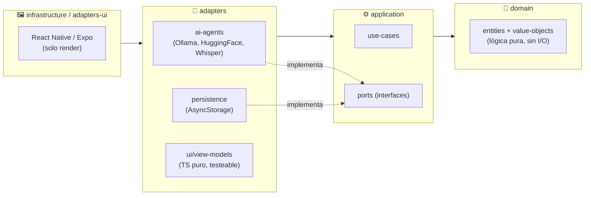

# 🤖 Mobile AI Assistance

> App móvil de **asistencia con IA**: un chat que conversa con **agentes de IA gratuitos** (Ollama local o HuggingFace), con adjuntar archivos, fotos y **notas de voz transcritas**. Construida con **Clean Architecture** y **TDD (Spec-First)** sobre **TypeScript + React Native / Expo**.

<p align="center">
  
  
  
  
  
  
</p>

---

## 💡 La idea

Un asistente de IA en el celular que **no depende de APIs pagas**: podés conectarlo a un **Ollama** corriendo en tu máquina (100% local y gratis) o a **HuggingFace** con un token gratuito. El proveedor se elige **en runtime** desde la propia UI, y todos los agentes se comportan igual gracias a un contrato compartido.

El foco técnico es la **arquitectura**: el núcleo de negocio (dominio + casos de uso) se construyó y testeó **sin framework** hasta tener cobertura verde; recién entonces se le puso React Native encima como una simple capa de render. La lógica de UI vive en *view-models* de TS puro testeables, no en los componentes.

---

## ✨ Características

- 💬 **Chat con IA** con historial persistente (AsyncStorage).
- 🔀 **Selector de proveedor en runtime** — Ollama ⇄ HuggingFace sin reiniciar.
- ⚡ **Envío optimista** — tu mensaje aparece al instante + "La IA está pensando…".
- 📎 **Adjuntar archivos** — los de texto se inyectan al prompt; los binarios van por referencia.
- 📷 **Cámara** — sacá una foto y adjuntala (con miniatura en el chip).
- 🎤 **Notas de voz** — graba, **transcribe con Whisper** (HuggingFace) y **manda solo**.
- 👁️ **Visión** — el agente multimodal (gemma-3) **ve** las fotos que mandás (no solo el nombre).
- 🗂️ **Historial lateral** translúcido (drawer con efecto vidrio) — **renombrar** y **borrar** conversaciones.
- 🎨 **Tema visual** propio — gradientes, glow, tipografía display y animaciones one-shot.

---

## 📸 Capturas

> Guardá tus capturas en [`docs/img/`](docs/img/) con estos nombres (se obtienen directo del celular o con `pnpm web` en viewport mobile). Podés sumar más a la tabla cuando quieras (ej. `historial.png`, `voz.png`).

| Inicio (selector de agente) | Conversación |
|:---:|:---:|
|  |  |

---

## 🧱 Arquitectura

**Clean Architecture** con la **regla de dependencia hacia adentro**. El sentido de los imports lo **hace cumplir ESLint** (`no-restricted-imports`): si un import cruza una frontera prohibida, `pnpm lint` falla — no es solo convención.



| Capa | Qué vive acá | Reglas |
|---|---|---|
| **`domain/`** | Entities y Value Objects. Constructor privado + factory, inmutables, se autovalidan, rompen invariantes con `DomainError`. | Lógica pura. **No** importa ninguna otra capa. |
| **`application/`** | Use-cases + **Ports** (interfaces). Reciben los Ports por constructor (DIP). | Expresa el *qué*, no el *cómo*. No importa `adapters`/`infrastructure`. |
| **`adapters/`** | Implementaciones: `ai-agents/`, `persistence/`, `ui/` (componentes + view-models). | Traducen el mundo real a los Ports. |
| **`infrastructure/`** | Composition Root (`di/container.ts`), `config/env.ts` (único que lee `process.env`), `app/App.tsx`. | Único lugar que instancia clases concretas. |
| **`shared/`** | `Result<T,E>` y jerarquía de errores tipados. | Transversal. |

**Convención de errores:** el **dominio lanza** (`throw`) subclases de `DomainError` para violar invariantes; **application y adapters devuelven `Result<T, E>`** — así el camino de error queda en la firma del tipo.

### Estructura de carpetas

```
src/
├── domain/              # entities/ + value-objects/  (núcleo puro)
├── application/         # use-cases/ + ports/
├── adapters/
│   ├── ai-agents/       # Ollama, HuggingFace, Whisper (STT), routing, http
│   ├── persistence/     # InMemory + AsyncStorage repos
│   └── ui/              # components/ screens/ view-models/ hooks/ navigation/ theme/ di/
├── infrastructure/      # app/ config/ di/  (Composition Root)
└── shared/              # result/ errors/ utils/
tests/                   # domain/ application/ contracts/ infrastructure/ adapters/ + builders/ fakes/
```

---

## 🚀 Cómo ejecutar

### Requisitos
- **Node** ≥ 20 y **pnpm** ≥ 9 (vía corepack).
- Para probar en celular: la app **Expo Go** (en iPhone físico soporta hasta **SDK 54**).
- Un proveedor de IA: **Ollama** local *(opcional, gratis)* o un **token de HuggingFace** *(gratis)*.

### Pasos
```bash
corepack enable                          # una vez (en Windows puede requerir admin)
corepack prepare pnpm@9.12.0 --activate
pnpm install                             # instalar dependencias (node-linker=isolated)
cp .env.example .env                     # configurar (ver tabla de variables abajo)
pnpm start                               # Metro / dev server
```

Luego escaneá el QR con **Expo Go**, o:
```bash
pnpm tunnel                      # probar en celular fuera de la LAN (usa @expo/ngrok)
pnpm web                         # abrir en el navegador
pnpm android | pnpm ios          # emulador / simulador
```

### 🌐 URLs locales
| Qué | URL |
|---|---|
| Metro / dev server (bundler + DevTools) | `http://localhost:8081` |
| Bundle web (`pnpm web`) | `http://localhost:8081` |
| Ollama local (si lo usás como proveedor) | `http://localhost:11434/api` |

> **Windows + OneDrive:** si Metro falla con `EINVAL: readlink` por la caché incremental, usá `pnpm start` (ya incluye `--clear`).

---

## ⚙️ Variables de entorno

Copiá [`.env.example`](.env.example) → `.env`. En el runtime de Expo se leen con prefijo `EXPO_PUBLIC_` (las inyecta Babel en build); las personales (host del packager, etc.) van en `.env.local`. **Nunca commitees tokens reales** (ambos archivos están gitignoreados).

| Variable | Default | Descripción |
|---|---|---|
| `AI_AGENT_PROVIDER` | `ollama` | `ollama` (local) \| `huggingface` |
| `AI_AGENT_BASE_URL` | — | Endpoint del agente (ej. `https://router.huggingface.co/v1`) |
| `AI_AGENT_MODEL` | — | Modelo (ej. `google/gemma-3-12b-it`) |
| `AI_AGENT_API_KEY` | — | Token HF (**requerido** si `provider=huggingface`) |
| `AI_STT_BASE_URL` | `https://router.huggingface.co/hf-inference/models` | Endpoint de transcripción (Whisper) |
| `AI_STT_MODEL` | `openai/whisper-large-v3` | Modelo de transcripción |
| `AI_STT_API_KEY` | (cae al token del agente) | Token HF para STT, opcional |

La validación es con **Zod** en `config/env.ts`: falla rápido si la config es inválida y exige `AI_AGENT_API_KEY` cuando el proveedor es HuggingFace. Las claves se leen **solo** ahí; nunca se hardcodean.

---

## 🧪 Testing (TDD)

El proyecto se desarrolla **Spec-First**: RED → GREEN → REFACTOR, subiendo de capa hacia afuera. Toda la lógica (incluida la de UI, en los view-models) se testea con **Vitest** sin renderizar componentes — *"Vitest para todo"*.

```bash
pnpm test                # toda la suite (una vez)
pnpm test:watch          # modo watch (ciclo RED → GREEN → REFACTOR)
pnpm test:domain         # solo dominio
pnpm test:contracts      # contratos de Ports (cada adapter debe pasar el mismo test)
pnpm test:coverage       # cobertura v8 (umbral 80% en domain/application)
pnpm typecheck           # tsc --noEmit (parte del "verde")
pnpm lint                # eslint --max-warnings=0 (hace cumplir las fronteras de capas)
```

Correr **un solo archivo o test**:
```bash
pnpm exec vitest run tests/domain/Conversation.spec.ts
pnpm exec vitest run -t "no permite agregar mensajes a una conversacion cerrada"
```

**79 tests** en verde. Los tests espejan las capas: `domain/` (unitarios), `application/` (aceptación con Fakes de los Ports), `contracts/` (un mismo `*.contract.ts` corre contra cada adapter), `infrastructure/` (Composition Root), `adapters/` (view-models). Los datos de prueba se crean con **Test Data Builders** y los Ports se doblan con **Fakes** reutilizables.

---

## 📜 Scripts

| Script | Qué hace |
|---|---|
| `pnpm start` / `tunnel` / `web` | Dev server (Metro) / túnel ngrok / bundle web |
| `pnpm android` / `ios` | Abrir en emulador / simulador |
| `pnpm test` / `test:watch` | Suite Vitest / modo watch |
| `pnpm typecheck` | `tsc --noEmit` |
| `pnpm lint` / `format` | ESLint (fronteras de capas) / Prettier |
| `pnpm build` | `tsc` → `dist/` |

---

## 🛠️ Stack

**TypeScript** · **React Native 0.81 / Expo SDK 54 / React 19** · **React Navigation** · **AsyncStorage** · **Zod** (validación de DTOs/env) · **Vitest** (+ coverage v8) · **ESLint / Prettier** · **pnpm** (`node-linker=isolated`, anti-dependencias-fantasma).
Expo plugins / módulos: `expo-audio` (grabación), `expo-image-picker` (cámara), `expo-document-picker`, `expo-clipboard`, `expo-blur`, `expo-linear-gradient`, `expo-font`.

---

## 🗺️ Estado y próximos pasos

✅ Chat · selector de proveedor · adjuntos · cámara · notas de voz con transcripción · **visión** · envío optimista · animaciones.

Pendientes:
- 🔎 **Búsqueda** de conversaciones en el historial.
- ✅ Confirmación de borrado.

> Para detalles finos de implementación y decisiones de Expo, ver [`CLAUDE.md`](CLAUDE.md).
# AsitanceAI

